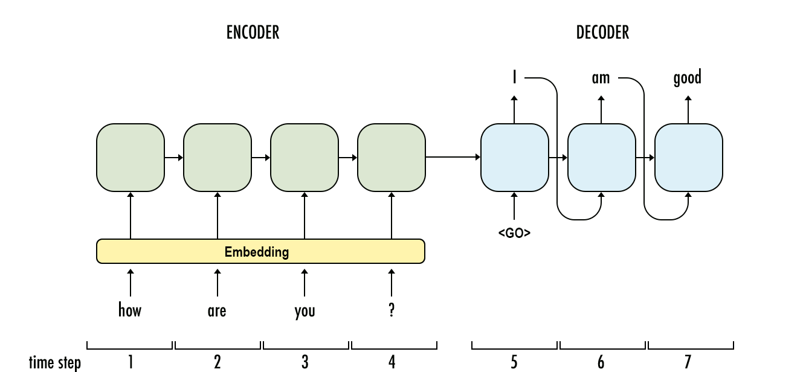

# text-summarizer
Text Summarization using Pytorch

This repository provides an implementation of Seq2Seq Model that focuses on summarizing a given sentence. This project is adapted from Pytorch Tutorial of Language Translation "https://pytorch.org/tutorials/intermediate/seq2seq_translation_tutorial.html"
For training I have used a subset from the Dataset of Amazon Reviews "https://www.kaggle.com/datasets/snap/amazon-fine-food-reviews"
For Embeddings, I have used glove word vectors (Wikipedia 2014 + Gigaword 5, 6B, 50d) "https://nlp.stanford.edu/projects/glove/"

The Model uses Encoder Decoder Architecture

Model.py file contains two models that use similar architecture but one uses Attention and other one does not.